# Gallery

Chart appearance in `svgd` is defined entirely in JavaScript
(`src/scripts/generate_svg.js`) — the C code only moves data. This page is a
living showcase of that idea: every chart below is the **same C binary**
rendered with a different theme or metric config, no recompile in between.

## Themes

Three palettes ship out of the box. The active theme is resolved per request
with this precedence:

1. **`?theme=` query parameter** — highest priority, per-request override.
2. **`server.theme`** in `config.json` — global default for the backend.
3. **`light`** — built-in fallback.

Unknown values fall back to `light`, so a typo never breaks rendering.

| Theme | Canvas | Intent |
|-------|--------|--------|
| `light` | `#ffffff` | Default. Matches the dashboard's own light mode. |
| `dark` | `#1f2023` | Matches the dashboard's dark mode. Easy on the eyes at night. |
| `high-contrast` | `#000000` | Black canvas, pure white/yellow ink, thicker strokes, monospace. WCAG-minded; good for accessibility and print. |

### Same metric, three themes

A single-series percentage metric (CPU) under each theme:

=== "light"

    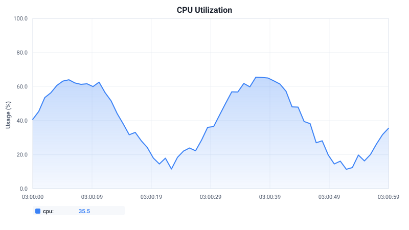{ loading=lazy title="CPU chart, light theme" style="width:100%;max-width:680px" }

=== "dark"

    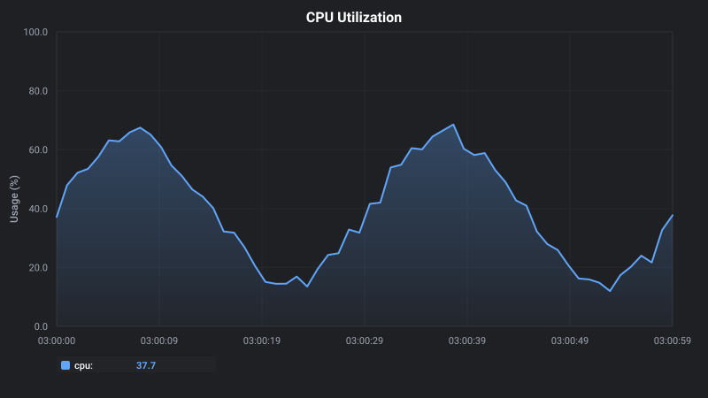{ loading=lazy title="CPU chart, dark theme" style="width:100%;max-width:680px" }

=== "high-contrast"

    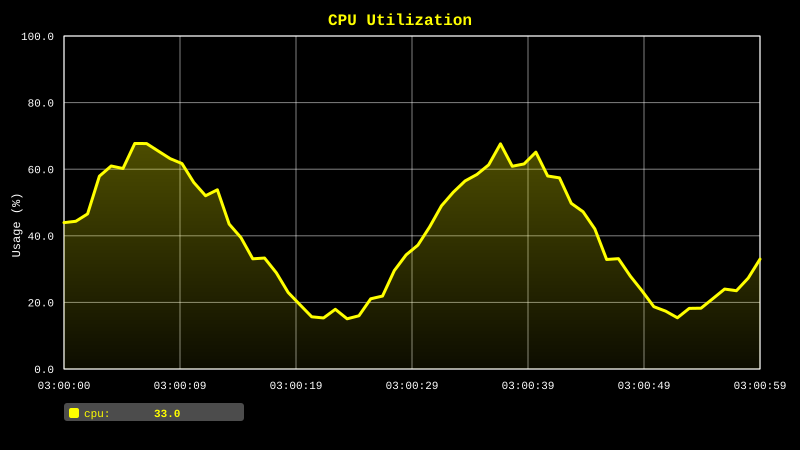{ loading=lazy title="CPU chart, high-contrast theme" style="width:100%;max-width:680px" }

A multi-series metric (network `rx`/`tx`) shows how the series palette adapts:

=== "light"

    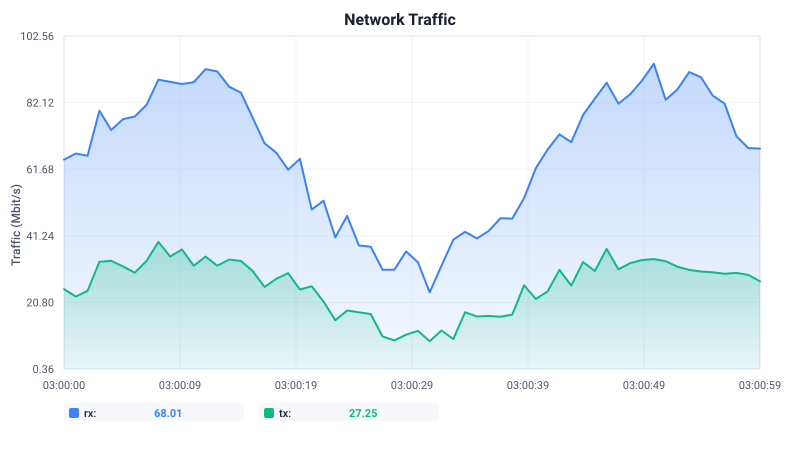{ loading=lazy title="Network chart, light theme" style="width:100%;max-width:680px" }

=== "dark"

    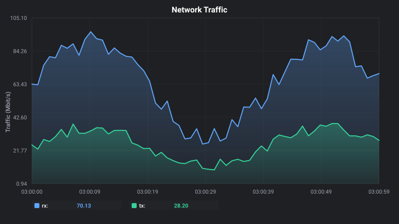{ loading=lazy title="Network chart, dark theme" style="width:100%;max-width:680px" }

=== "high-contrast"

    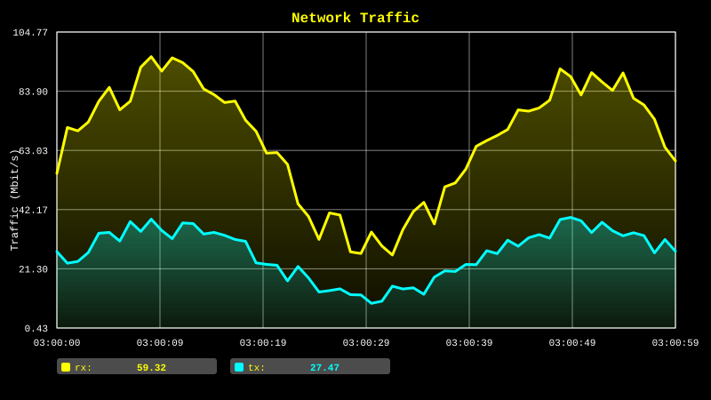{ loading=lazy title="Network chart, high-contrast theme" style="width:100%;max-width:680px" }

The `stat` panel type (a single big number with a sparkline) respects the same
palettes:

=== "light"

    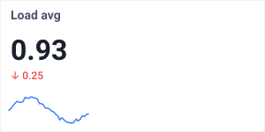{ loading=lazy title="Stat panel, light theme" style="width:100%;max-width:320px" }

=== "dark"

    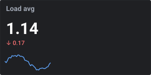{ loading=lazy title="Stat panel, dark theme" style="width:100%;max-width:320px" }

=== "high-contrast"

    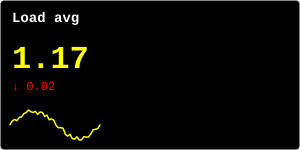{ loading=lazy title="Stat panel, high-contrast theme" style="width:100%;max-width:320px" }

### Selecting a theme

**Global default** — `config.json`:

```json
{
  "server": {
    "tcp_port": 8081,
    "theme": "dark"
  }
}
```

**Per-request override** — append `?theme=` to any metric URL. This is handy
for embedding a dark chart in a dark UI while leaving the backend default on
`light`:

```text
http://localhost:8080/cpu?theme=dark
http://localhost:8080/cpu?theme=high-contrast&width=1000
```

The `?theme=` parameter is forwarded end-to-end: `svgd-gate` passes the raw
query string through to the backend over LSRP, where `handler_process()` reads
it exactly like `width`/`height`. No gate configuration is needed.

> **Note:** the `svgd-gate` dashboard has its own client-side light/dark toggle
> (it recolours the rendered SVG in the browser). The backend theme described
> here is independent — it controls the colours the C binary emits, useful for
> direct embedding, Grafana, and the `stat`/`high-contrast` modes the dashboard
> does not cover.

## Metric types

`metrics[]` in `config.json` is data-driven: each entry maps a URL endpoint to
an RRD file and describes how to render it. Below are ready-to-use snippets for
common scenarios. All paths are relative to `rrd.base_path` (the collectd /
`svgd-collect` RRD directory).

### CPU — percentage

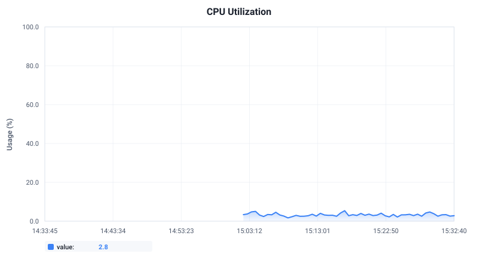{ loading=lazy title="CPU utilization" style="width:100%;max-width:680px" }

```json
{
  "endpoint": "cpu",
  "rrd_path": "cpu-total/percent-active.rrd",
  "title": "CPU Utilization",
  "y_label": "Usage (%)",
  "is_percentage": true,
  "value_format": "%.1f"
}
```

### RAM — percentage

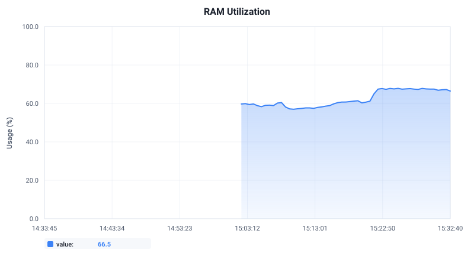{ loading=lazy title="RAM utilization" style="width:100%;max-width:680px" }

```json
{
  "endpoint": "ram",
  "rrd_path": "memory/percent-used.rrd",
  "title": "RAM Utilization",
  "y_label": "Usage (%)",
  "is_percentage": true,
  "value_format": "%.1f"
}
```

### Network — multi-series, bytes → Mbit/s

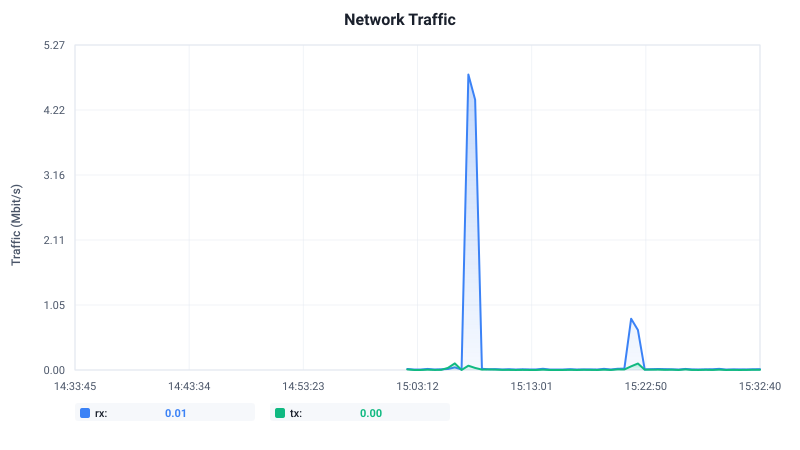{ loading=lazy title="Network traffic" style="width:100%;max-width:680px" }

```json
{
  "endpoint": "network",
  "rrd_path": "interface-%s/if_octets.rrd",
  "requires_param": true,
  "param_name": "interface",
  "title": "Network Traffic",
  "y_label": "Traffic (Mbit/s)",
  "transform_type": "divide",
  "transform_divisor": 125000,
  "value_format": "%.2f"
}
```

### Disk I/O — parameterized, per-device

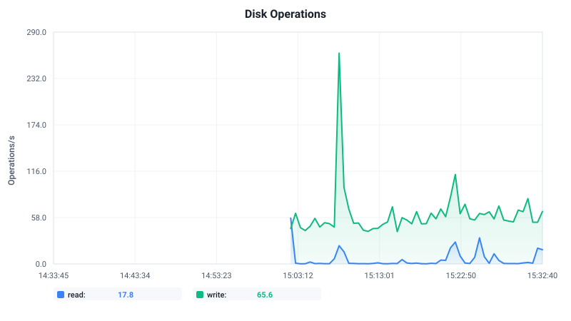{ loading=lazy title="Disk operations" style="width:100%;max-width:680px" }

```json
{
  "endpoint": "disk",
  "rrd_path": "disk-%s/disk_ops.rrd",
  "requires_param": true,
  "param_name": "disk",
  "title": "Disk Operations",
  "y_label": "Operations/s",
  "value_format": "%.1f"
}
```

### Process memory — parameterized, bytes → MB

A single process picked from the URL: `GET /ram/process/postgres`.

```json
{
  "endpoint": "ram/process",
  "rrd_path": "processes-%s/ps_rss.rrd",
  "requires_param": true,
  "param_name": "process_name",
  "title": "Memory: %s",
  "y_label": "Memory (MB)",
  "transform_type": "divide",
  "transform_divisor": 1048576,
  "value_format": "%.1f"
}
```

### PostgreSQL — fixed-path metric

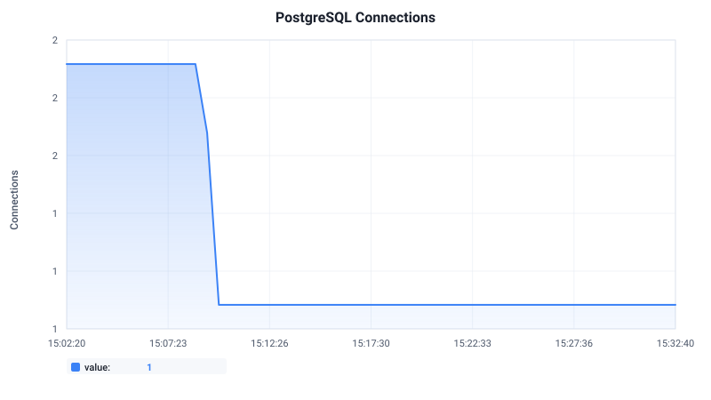{ loading=lazy title="PostgreSQL connections" style="width:100%;max-width:680px" }

```json
{
  "endpoint": "postgresql/connections",
  "rrd_path": "postgresql-test/pg_numbackends.rrd",
  "title": "PostgreSQL Connections",
  "y_label": "Connections",
  "value_format": "%d"
}
```

### Scenario: Docker host

A Docker host is just a Linux host plus per-container cgroup metrics. Point
`svgd` at the same collectd RRD tree and add a parameterized endpoint per
container. Adjust `rrd_path` to match your collectd `cgroup`/`docker` plugin
configuration.

```json
{
  "endpoint": "docker/cpu",
  "rrd_path": "docker-%s/cpu-usage.rrd",
  "requires_param": true,
  "param_name": "container",
  "title": "Container CPU: %s",
  "y_label": "Usage (%)",
  "is_percentage": true,
  "value_format": "%.1f"
},
{
  "endpoint": "docker/mem",
  "rrd_path": "docker-%s/mem-usage.rrd",
  "requires_param": true,
  "param_name": "container",
  "title": "Container Memory: %s",
  "y_label": "Memory (MB)",
  "transform_type": "divide",
  "transform_divisor": 1048576,
  "value_format": "%.1f"
}
```

```text
GET /docker/cpu/redis?theme=dark
GET /docker/mem/nginx
```

### Scenario: Raspberry Pi (thermal + load)

On a Pi (or any SoC), temperature is the metric you care about.
[`svgd-collect`](https://github.com/Pavelavl/svgd) reads
`/sys/class/thermal/thermal_zone0/temp` and writes it to
`thermal/temperature-*.rrd`, so no collectd setup is needed.

```json
{
  "endpoint": "temperature",
  "rrd_path": "thermal/temperature-%s.rrd",
  "requires_param": true,
  "param_name": "zone",
  "title": "Temperature: %s",
  "y_label": "Temperature (°C)",
  "value_format": "%.1f"
},
{
  "endpoint": "system/load",
  "rrd_path": "load/load.rrd",
  "title": "System Load Average",
  "y_label": "Load",
  "value_format": "%.2f"
}
```

```text
GET /temperature/thermal_zone0
GET /system/load?theme=high-contrast
```

### Stat panels — single big number + sparkline

Set `"panel_type": "stat"` to render a KPI tile instead of a time chart: the
last value large, a trend arrow, and a sparkline. Ideal for a top-row summary.

```json
{
  "endpoint": "stat/load",
  "rrd_path": "load/load.rrd",
  "title": "Load avg",
  "panel_type": "stat",
  "value_format": "%.2f"
}
```

## Adding a custom theme

This is the whole point of doing rendering in JS: **a new palette is a few
lines of data, not a C release.** Open `src/scripts/generate_svg.js` and add a
key to the `THEMES` object:

```javascript
var THEMES = {
    light:          { /* ... */ },
    dark:           { /* ... */ },
    'high-contrast': { /* ... */ },

    // Add yours — immediately usable as ?theme=solarized / "server.theme": "solarized"
    solarized: {
        background: '#002b36',
        gridLines:  '#073642',
        text:       '#839496',
        textPrimary:'#eee8d5',
        axis:       '#839496',
        series:     ['#268bd2', '#859900', '#b58900', '#dc322f', '#6c71c4', '#d33682'],
        seriesWidth: 2,
        fontFamily: "-apple-system, BlinkMacSystemFont, 'Segoe UI', Roboto, sans-serif",
        border:     '#073642',
        accent:     '#268bd2',
        positive:   '#859900',
        negative:   '#dc322f',
        neutral:    '#839496',
        sparkline:  '#268bd2',
        tooltipFill:'#073642',
        tooltipOpacity: 0.92,
        tooltipStroke:'#586e75'
    }
};
```

Restart the backend (the JS file is re-read on start) and the new theme is live:

```text
GET /cpu?theme=solarized
```

No `make build`, no C edit, no restart of `svgd-gate`. The C side already
forwards `?theme=` and pushes `options.theme` into the JS — it is agnostic to
which theme names exist. See [Architecture](architecture.md#svg-rendering-is-javascript-not-c)
for why this boundary exists.

## Related

- [Architecture](architecture.md) — why chart rendering lives in JavaScript.
- [Configuration](configuration.md) — full `config.json` schema, including `server.theme`.
- [Quick start](quickstart.md) — get a backend running in two commands.
