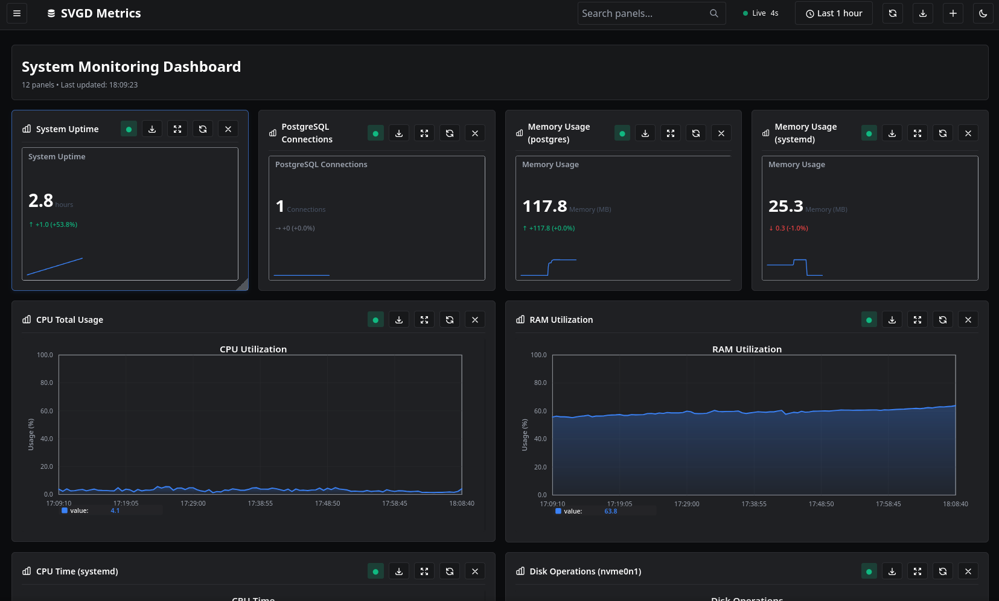

# svgd

The most resource-efficient way to get beautiful system-metric charts — for
edge / IoT / embedded / constrained devices, and for embedding into any
interface via zero-dependency SVG.

`svgd` is a lightweight C monitoring system that renders SVG charts from RRD
time-series files. It is built around extreme resource efficiency: benchmarked at
**~0% CPU / ~10 MB RAM** under load while serving up to **2830 requests/sec**.

<figure markdown>
  { loading=lazy }
  <figcaption>The svgd-gate web dashboard.</figcaption>
</figure>

---

## Why svgd?

Monitoring tools that look good tend to be heavy; the light ones tend to look
bad. `svgd` is deliberately both — a native-C rendering pipeline that stays
out of the way of the host it monitors.

Three things make it different:

:material-chart-line-variant: **1. Extreme resource efficiency**

:   Handles up to **2830 RPS** at **~0% CPU** and **~10 MB RAM**. Under a
    comparable load, Graphite uses 70% CPU and **241 MB RAM** (~24x more memory);
    RRDtool CGI is **28–58x slower** in throughput. `svgd` is the only system in
    its class that holds ~0% CPU under every load we tested, with a flat ~10 MB
    memory footprint. Ideal for Raspberry Pi, routers, $2 VPS, and embedded
    targets where a 240 MB resident set is not an option.

:material-code-tags: **2. Embeddable, zero-dependency SVG output**

:   Every endpoint returns a self-contained SVG chart you can drop into any page
    with a single `` or inline `<svg>`. No client-side JS, no
    bundler, no framework. Charts render in static HTML, Markdown, wikis, READMEs,
    and dashboards alike. This is an under-served use case — none of the
    comparable tools ship "embeddable chart" output from the box.

:material-language-javascript: **3. JS-extensible rendering — no recompile**

:   Charts are produced by an embedded [Duktape](https://duktape.org/) engine
    running `src/scripts/generate_svg.js`. You change chart appearance, scales,
    colors, or behavior by editing JavaScript — the C binary does not need to be
    rebuilt. This is the primary extensibility surface and the lowest-friction
    way to make `svgd` look the way you want.

---

## At a glance

| | svgd |
|---|---|
| **Language** | C (backend & gateway) + JS (rendering) |
| **Runtime memory** | ~10 MB under load |
| **CPU under load** | ~0% |
| **Peak throughput** | 2830 RPS (c=50), linear scaling from 1347 RPS (c=1) |
| **Output** | Self-contained SVG (per endpoint) |
| **Storage** | RRD time-series files (via librrd) |
| **Wire protocol** | LSRP (binary, default) or plain HTTP |
| **Dependencies** | librrd, duktape, openssl (optional auth) |
| **License** | MIT |

---

## Where it fits

`svgd` is not a replacement for Prometheus + Grafana at hyperscale. It is the
right tool when any of these is true:

- You are monitoring a **constrained host** (router, Pi, NAS, embedded controller,
  micro-VPS) and a 200 MB+ agent is not acceptable.
- You want **charts you can embed** — in a static status page, a README, a wiki,
  an external dashboard — without standing up a frontend.
- You want **beautiful charts but control the look** without forking a C
  codebase.
- You already run **collectd** (or `svgd-collect`) and want a fast, pretty
  rendering layer over the same RRD files.

For an honest side-by-side with Monitorix, Munin, and Netdata — including where
`svgd` is weaker — see the [Comparison](comparison.md) page.

---

## Get going in 60 seconds

```bash
git clone https://github.com/Pavelavl/svgd.git
cd svgd
git submodule update --init --recursive   # lsrp + svgd-collect
sudo apt install librrd-dev duktape-dev gcc make jq libssl-dev
make build
make run          # svgd-gate web UI on http://localhost:8080
```

Full steps, configuration, and the `svgd-collect` drop-in collector are on the
[Quick start](quickstart.md) and [Installation](install.md) pages.

---

## Project status

`svgd` is approaching its first public release. See the
[Roadmap](roadmap.md) for what is done, what is in progress, and what is
planned (Prometheus `/metrics`, packaging, pluginable reader, and more).
