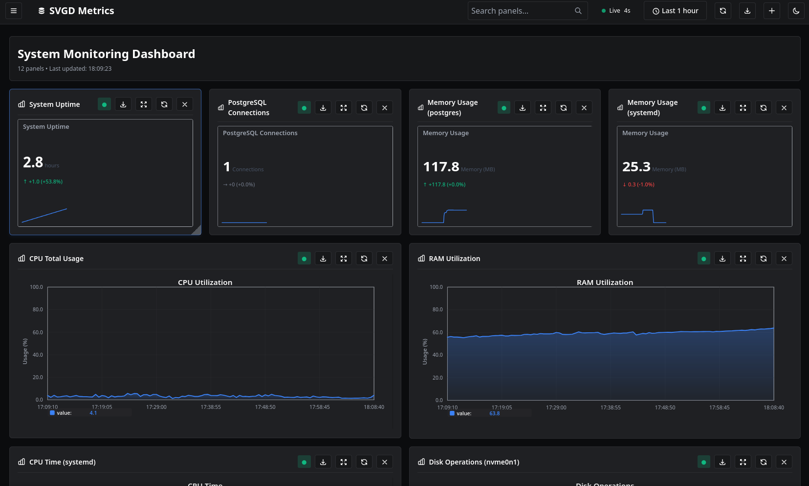

# svgd



Легковесная система мониторинга с динамической конфигурацией метрик, состоящая из:
1. **svgd** — LSRP-сервер для генерации SVG-графиков
2. **svgd-gate** — HTTP-шлюз для REST API доступа
3. **Веб-интерфейс** — интерактивный дашборд для визуализации метрик
4. **collectd** — сбор системных метрик

---

## Установка и настройка

### Требования

Зависимости:
- **librrd-dev** — библиотека для работы с RRD-файлами
- **libduktape-dev** — JS-движок Duktape для генерации SVG
- **collectd** — сбор системных метрик
- **jq** — (опционально) для парсинга config.json в Makefile
- **gcc**

---

### Настройка collectd

Сборку и развертывание collectd производить по [этой инструкции](https://github.com/Pavelavl/cpu-http-monitor). 

Примеры конфигураций находятся [тут](collectd/):

```
collectd/
├── collectd.conf              # Основной конфиг
└── collectd.conf.d/
    ├── cpu.conf              # CPU метрики
    ├── df.conf               # Файловые системы
    ├── disk.conf             # Дисковые операции
    ├── load.conf             # Load average
    ├── memory.conf           # Память
    ├── network.conf          # Сетевой трафик
    ├── postgresql.conf       # PostgreSQL метрики
    ├── processes.conf        # Процессы
    ├── swap.conf             # Swap
    └── uptime.conf           # Uptime
```

---

### Установка зависимостей

```bash
sudo apt update
sudo apt install librrd-dev libduktape-dev gcc
```

---

### Настройка rrdcached

Для повышения производительности при работе с RRD-файлами используется демон rrdcached:

```bash
sudo rrdcached -p /var/run/rrdcached.pid \
               -l unix:/var/run/rrdcached.sock \
               -B \
               -F \
               -b /opt/collectd/var/lib/collectd/rrd \
               -j /var/lib/rrdcached/journal \
               -f 3600 \
               -w 1800 \
               -z 900
```

#### Описание параметров:
- **-p** — путь к файлу PID демона
- **-l** — использование Unix-сокета для связи
- **-B** — запрет записи в RRD-файлы вне базового пути
- **-F** — принудительная синхронизация данных на диск
- **-b** — базовый путь для RRD-файлов
- **-j** — путь для журнала обновлений
- **-f 3600** — интервал полной синхронизации (в секундах)
- **-w 1800** — интервал записи данных на диск
- **-z 900** — задержка перед записью данных

Создайте необходимые директории:
```bash
sudo mkdir -p /opt/collectd/var/lib/collectd/rrd /var/lib/rrdcached/journal
sudo chown $(whoami) /opt/collectd/var/lib/collectd/rrd /var/lib/rrdcached/journal
```

---

## Сборка и запуск

### Сборка всех компонентов

```bash
# Сборка LSRP сервера (svgd)
make build

# Сборка HTTP шлюза (svgd-gate)
make build-gw
```

### Запуск сервера

```bash
# Запуск LSRP сервера (порт из config.json)
make run

# Запуск HTTP шлюза (по умолчанию порт 8080)
make run-gw
```

### Открытие веб-интерфейса

После запуска откройте в браузере [index.html](static/index.html)

---

## Конфигурация

### Структура config.json

```json
{
  "server": {
    "tcp_port": 8081,                    // Порт LSRP сервера
    "allowed_ips": "127.0.0.1",          // Разрешённые IP
    "rrdcached_addr": ""                 // Адрес rrdcached (опционально)
  },
  "rrd": {
    "base_path": "/opt/collectd/var/lib/collectd/rrd/localhost"
  },
  "js": {
    "script_path": "/path/to/generate_cpu_svg.js"
  },
  "metrics": [ /* массив метрик */ ]
}
```

### Конфигурация метрики

Каждая метрика в массиве `metrics` имеет следующие параметры:

#### Обязательные параметры:
- **endpoint** — URL путь для доступа к метрике
- **rrd_path** — путь к RRD файлу относительно `base_path`

#### Опциональные параметры:
- **requires_param** (bool) — требуется ли параметр в URL
- **param_name** (string) — имя параметра (для UI)
- **title** (string) — заголовок графика (поддерживает `%s` для параметра)
- **y_label** (string) — подпись оси Y
- **is_percentage** (bool) — метрика в процентах (0-100%)
- **transform_type** (string) — тип трансформации данных:
  - `none` — без трансформации
  - `divide` — деление на `transform_divisor`
  - `multiply` — умножение на `value_multiplier`
  - `ps_cputime_sum` — суммирование user+system CPU time
- **transform_divisor** (float) — делитель для трансформации
- **value_multiplier** (float) — множитель для значений
- **value_format** (string) — формат вывода значений (printf-style)

#### Примеры конфигурации метрик:

**Простая метрика (CPU):**
```json
{
  "endpoint": "cpu",
  "rrd_path": "cpu-total/percent-active.rrd",
  "requires_param": false,
  "title": "CPU Utilization",
  "y_label": "Usage (%)",
  "is_percentage": true,
  "transform_type": "none",
  "value_format": "%.1f"
}
```

**Метрика с параметром (Memory процесса):**
```json
{
  "endpoint": "ram/process",
  "rrd_path": "processes-%s/ps_rss.rrd",
  "requires_param": true,
  "param_name": "process_name",
  "title": "Memory Usage for %s",
  "y_label": "Memory (MB)",
  "is_percentage": false,
  "transform_type": "divide",
  "transform_divisor": 1048576,
  "value_format": "%.1f"
}
```

**Метрика с автоматической конвертацией (Filesystem):**
```json
{
  "endpoint": "filesystem",
  "rrd_path": "df-mnt-%s/percent_bytes-used.rrd",
  "requires_param": true,
  "param_name": "fs_name",
  "title": "Filesystem Usage (mnt-%s)",
  "y_label": "Usage (%)",
  "is_percentage": true,
  "transform_type": "none",
  "value_format": "%.1f"
}
```

---

## API

### HTTP REST API (svgd-gate)

Все запросы отправляются через HTTP шлюз на порт 8080:

#### Получить список доступных метрик
```bash
GET http://localhost:8080/_config/metrics
```

**Ответ:**
```json
{
  "version": "1.0",
  "metrics": [
    {
      "endpoint": "cpu",
      "requires_param": false,
      "title": "CPU Utilization",
      "y_label": "Usage (%)",
      "is_percentage": true
    },
    {
      "endpoint": "ram/process",
      "requires_param": true,
      "param_name": "process_name",
      "title": "Memory Usage for %s",
      "y_label": "Memory (MB)",
      "is_percentage": false
    }
  ]
}
```

#### Получить SVG график
```bash
GET http://localhost:8080/<endpoint>?period=<seconds>
```

**Параметры:**
- `period` — временной диапазон в секундах (по умолчанию 3600)

**Примеры:**

```bash
# CPU за последний час
curl http://localhost:8080/cpu

# CPU за последние 24 часа
curl http://localhost:8080/cpu?period=86400

# Memory конкретного процесса
curl http://localhost:8080/ram/process/postgres?period=3600

# Сетевой трафик интерфейса
curl http://localhost:8080/network/eth0?period=7200
```

### LSRP Protocol API

Для прямого доступа к LSRP серверу:

```bash
./lsrp/bin/lsrp localhost:8081 "endpoint=<endpoint>&period=<seconds>"
```

**Примеры:**
```bash
# CPU метрика
./lsrp/bin/lsrp localhost:8081 "endpoint=cpu&period=3600"

# Процесс с параметром
./lsrp/bin/lsrp localhost:8081 "endpoint=cpu/process/systemd&period=7200"

# Список метрик
./lsrp/bin/lsrp localhost:8081 "endpoint=_config/metrics"
```

---

## Примеры метрик

| Endpoint | Описание | Параметр | График |
|----------|----------|----------|--------|
| `cpu` | Общая загрузка CPU (%) | — | [cpu.svg](examples/cpu.svg) |
| `cpu/process/<name>` | CPU time процесса | process_name | [cpu_process_systemd.svg](examples/cpu_process_systemd.svg) |
| `ram` | Общая загрузка памяти (%) | — | [ram.svg](examples/ram.svg) |
| `ram/process/<name>` | Память процесса (MB) | process_name | [ram_process_postgres.svg](examples/ram_process_postgres.svg) |
| `network/<interface>` | Сетевой трафик (B/s) | interface | [network.svg](examples/network.svg) |
| `disk/<disk>` | Дисковые операции (ops/s) | disk | [disk.svg](examples/disk.svg) |
| `postgresql/connections` | Подключения к PostgreSQL | — | [pgsql.svg](examples/pgsql.svg) |
| `system/load` | Load average (1/5/15min) | — | — |
| `system/uptime` | Uptime системы (hours) | — | — |
| `swap/usage` | Использование swap (%) | — | — |
| `swap/bytes` | Использование swap (MB) | — | — |
| `filesystem/<name>` | Использование ФС (%) | fs_name | — |

---

## Веб-интерфейс

### Возможности дашборда

- **Динамическое добавление панелей** — выбор из списка доступных метрик
- **Настройка временного диапазона** — от 5 минут до 7 дней
- **Автообновление** — настраиваемый интервал (5 сек - 5 мин)
- **Поиск панелей** — фильтрация по названию
- **Полноэкранный режим** — для детального просмотра
- **Экспорт панелей** — сохранение SVG графиков
- **Темы оформления** — светлая и тёмная тема
- **Экспорт/импорт конфигурации** — сохранение настроек дашборда
- **Снимки дашборда** — сохранение всех графиков в HTML

### Горячие клавиши

- `Esc` — закрыть модальные окна и выпадающие меню

### Настройки дашборда

В боковой панели (кнопка ☰) доступны:
- Название дашборда
- Интервал автообновления
- API сервер
- Опции отображения

---

## Производительность

### Adaptive Step Selection

Система автоматически выбирает оптимальное разрешение данных (step) для запрошенного временного диапазона:

- **Цель:** 100-1000 точек данных на график
- **Короткие диапазоны (≤1 час):** максимальное разрешение (pdp_per_row=1)
- **Длинные диапазоны:** автоматическое агрегирование данных

### Benchmark результаты

#### Parallel запросы (10 конкурентных)

**1000 запросов:**
| Конфигурация | Среднее время | Пропускная способность | CPU |
|--------------|---------------|------------------------|-----|
| HTTP без rrdcached | 5.5 мс | 1796 req/s | 394% |
| HTTP с rrdcached | 5.6 мс | 1770 req/s | 455% |
| LSRP без rrdcached | 5.5 мс | 1797 req/s | 395% |
| LSRP с rrdcached | 5.6 мс | 1740 req/s | 456% |

**10000 запросов:**
| Метрика | HTTP | LSRP |
|---------|------|------|
| Успешность | 42-45% | 49-50% |
| Среднее время | 3.9 сек | 3.75 сек |
| CPU | ~400% | ~460% |
| Memory | 11-12 МБ | 10-11 МБ |

#### Sync запросы (последовательные)

**10000 запросов:**
| Конфигурация | Время | Пропускная способность |
|--------------|-------|------------------------|
| HTTP без rrdcached | 20.5 с | 487 req/s |
| HTTP с rrdcached | 20.8 с | 481 req/s |
| LSRP без rrdcached | 20.5 с | 487 req/s |
| LSRP с rrdcached | 20.8 с | 481 req/s |

**Вывод:** LSRP показывает на 5-10% лучшую производительность при высоких нагрузках (10k+ запросов).

---

## Тестирование

### Запуск тестов

```bash
# Сборка тестовых утилит
make build-tests

# Запуск Go тестов
make test
```

### Тестовые утилиты

- **metrics_collector** — сбор метрик производительности
- **response_time_test** — тестирование времени ответа
- **benchmark_test** — бенчмарк-тестирование

---

## Структура проекта

```
svgd/
├── bin/                      # Бинарные файлы
│   ├── svgd                  # LSRP сервер
│   └── svgd-gate             # HTTP шлюз
├── collectd/                 # Конфигурации collectd
├── config.json               # Основная конфигурация
├── examples/                 # Примеры графиков
├── gate/                     # Исходники HTTP шлюза
├── include/                  # Заголовочные файлы
│   ├── cfg.h                 # Конфигурация
│   └── rrd_r.h               # RRD reader
├── lsrp/                     # LSRP протокол
├── scripts/                  # JavaScript для генерации SVG
├── src/                      # Исходники сервера
│   ├── cfg.c                 # Парсинг конфигурации
│   ├── main.c                # Основной сервер
│   └── rrd_r.c               # Чтение RRD и генерация SVG
├── static/                   # Веб-интерфейс
│   ├── dashboard.js          # Логика дашборда
│   └── index.html            # HTML интерфейс
└── tests/                    # Тесты
```

---

## Расширение функциональности

### Добавление новой метрики

1. Настройте collectd для сбора данных
2. Добавьте метрику в `config.json`:

```json
{
  "endpoint": "my/metric",
  "rrd_path": "my-metric/data.rrd",
  "requires_param": false,
  "title": "My Custom Metric",
  "y_label": "Value",
  "is_percentage": false,
  "transform_type": "none",
  "value_format": "%.2f"
}
```

3. Перезапустите svgd:
```bash
make run
```

4. Метрика автоматически появится в веб-интерфейсе

### Кастомные трансформации

Для сложных трансформаций можно модифицировать `scripts/generate_cpu_svg.js`:

```javascript
function transformValue(value, options) {
  if (options.transformType === 'custom') {
    // Ваша логика трансформации
    return value * 2 + 10;
  }
  return value;
}
```

---

## Troubleshooting

### Сервер не запускается

```bash
# Проверьте порты
netstat -tulpn | grep 8080
netstat -tulpn | grep 8081

# Проверьте права доступа к RRD файлам
ls -la /opt/collectd/var/lib/collectd/rrd/

# Проверьте логи
./bin/svgd ./config.json  # Смотрите stderr
```

### Графики не отображаются

```bash
# Проверьте наличие RRD файлов
ls -la /opt/collectd/var/lib/collectd/rrd/localhost/

# Проверьте доступность API
curl http://localhost:8080/_config/metrics

# Проверьте конкретную метрику
curl http://localhost:8080/cpu?period=3600
```

### Низкая производительность

1. Включите rrdcached в `config.json`:
```json
"rrdcached_addr": "unix:/var/run/rrdcached.sock"
```

2. Уменьшите интервал автообновления в веб-интерфейсе

3. Используйте меньшее количество панелей одновременно

---

## Размер RRD файлов

| Файл | Размер |
|------|--------|
| cpu-total/percent-active.rrd | 145 KB |
| processes-*/ps_cputime.rrd | 288 KB |
| memory/percent-used.rrd | 145 KB |
| processes-*/ps_rss.rrd | 145 KB |
| interface-*/if_octets.rrd | 288 KB |
| disk-*/disk_ops.rrd | 288 KB |
| postgresql-*/pg_numbackends.rrd | 145 KB |

**Общий объём:** ~1.5 MB на систему + ~430 KB на каждый отслеживаемый процесс

---

## Связанные проекты

- LSRP - https://github.com/pavelavl/lsrp
- Collectd - https://github.com/collectd/collectd
- Duktape - https://github.com/svaarala/duktape