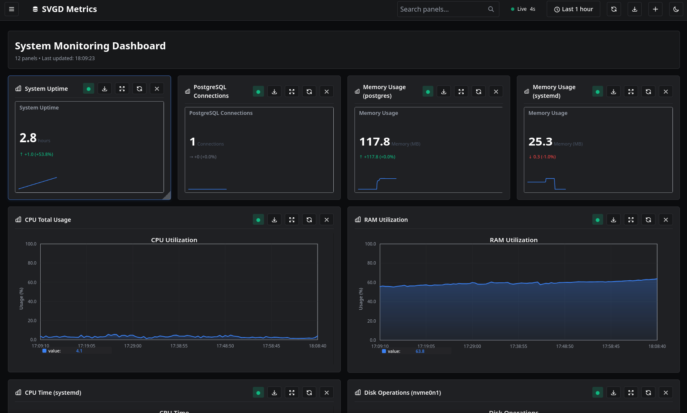
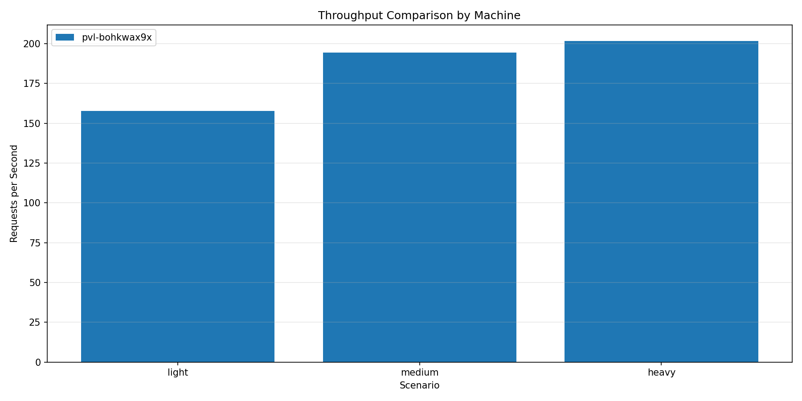
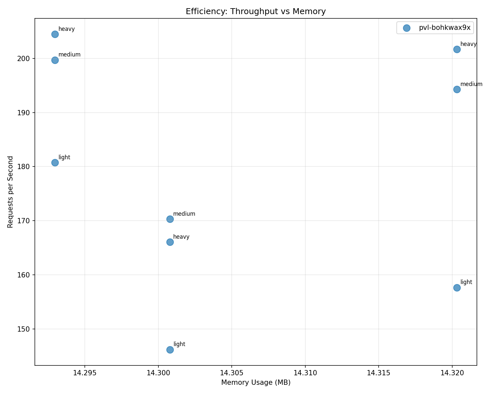
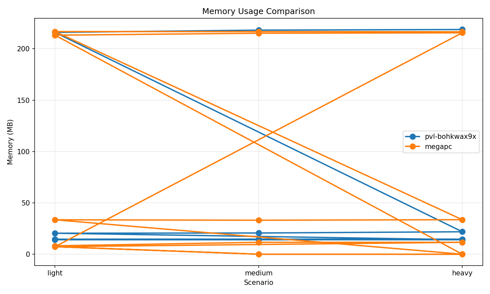

# svgd



Легковесная система мониторинга с динамической конфигурацией метрик.

**Компоненты:**
- **svgd** — LSRP-сервер для генерации SVG-графиков из RRD-файлов
- **svgd-gate** — HTTP-шлюз с веб-интерфейсом
- **collectd** — сбор системных метрик (внешний компонент)

---

## Установка

### Требования

- **librrd-dev** — библиотека для работы с RRD-файлами
- **libduktape-dev** — JS-движок Duktape для генерации SVG
- **gcc** — компилятор C
- **collectd** — сбор системных метрик
- **jq** — (опционально) для парсинга config.json в Makefile

### Установка зависимостей

```bash
sudo apt update
sudo apt install librrd-dev libduktape-dev gcc jq
```

### Сборка

```bash
# Сборка всех компонентов
make build

# Только backend (LSRP-сервер)
make build-backend
```

### Запуск

```bash
# HTTP-шлюз с веб-интерфейсом (порт 8080)
make run

# Только LSRP-сервер (порт из config.json, по умолчанию 8081)
make run-backend
```

После запуска откройте http://localhost:8080 в браузере.

---

## Конфигурация

### Структура config.json

```json
{
  "server": {
    "tcp_port": 8081,
    "protocol": "lsrp",
    "allowed_ips": "127.0.0.1",
    "rrdcached_addr": "",
    "thread_pool_size": 4,
    "cache_ttl_seconds": 5,
    "verbose": 0
  },
  "rrd": {
    "base_path": "/opt/collectd/var/lib/collectd/rrd/localhost"
  },
  "js": {
    "script_path": "./scripts/generate_svg.js"
  },
  "metrics": [ /* массив метрик */ ]
}
```

### Параметры сервера

| Параметр | Описание | По умолчанию |
|----------|----------|--------------|
| `tcp_port` | Порт LSRP-сервера | 8081 |
| `allowed_ips` | Разрешённые IP (через запятую) | 127.0.0.1 |
| `rrdcached_addr` | Адрес rrdcached (unix:/path или host:port) | "" |
| `thread_pool_size` | Размер пула потоков | 4 |
| `cache_ttl_seconds` | TTL кэша RRD-данных | 5 |
| `verbose` | Уровень логирования | 0 |

### Конфигурация метрик

#### Обязательные параметры

| Параметр | Описание |
|----------|----------|
| `endpoint` | URL путь для доступа |
| `rrd_path` | Путь к RRD-файлу (относительно base_path) |

#### Опциональные параметры

| Параметр | Описание |
|----------|----------|
| `requires_param` | Требуется ли параметр в URL |
| `param_name` | Имя параметра (для UI) |
| `title` | Заголовок графика (поддерживает `%s`) |
| `y_label` | Подпись оси Y |
| `is_percentage` | Метрика в процентах (0-100%) |
| `transform_type` | Тип трансформации: `none`, `divide`, `sum`, `multiply` |
| `transform_divisor` | Делитель для трансформации (`divide`) |
| `value_format` | Формат вывода (printf-style) |

#### Примеры метрик

**CPU (простая метрика):**
```json
{
  "endpoint": "cpu",
  "rrd_path": "cpu-total/percent-active.rrd",
  "title": "CPU Utilization",
  "y_label": "Usage (%)",
  "is_percentage": true,
  "value_format": "%.1f"
}
```

**Память процесса (с параметром и трансформацией):**
```json
{
  "endpoint": "ram/process",
  "rrd_path": "processes-%s/ps_rss.rrd",
  "requires_param": true,
  "param_name": "process_name",
  "title": "Memory Usage",
  "y_label": "Memory (MB)",
  "transform_type": "divide",
  "transform_divisor": 1048576,
  "value_format": "%.1f"
}
```

**Сеть (с параметром):**
```json
{
  "endpoint": "network",
  "rrd_path": "interface-%s/if_octets.rrd",
  "requires_param": true,
  "param_name": "interface",
  "title": "Network Traffic",
  "y_label": "Traffic (Mbit/s)",
  "transform_type": "divide",
  "transform_divisor": 125000,
  "value_format": "%.2f"
}
```

---

## API

### HTTP REST API (svgd-gate)

**Получить список метрик:**
```bash
GET http://localhost:8080/_config/metrics
```

**Получить SVG-график:**
```bash
GET http://localhost:8080/<endpoint>?period=<seconds>
```

Параметр `period` — временной диапазон в секундах (по умолчанию 3600).

**Примеры:**
```bash
# CPU за последний час
curl http://localhost:8080/cpu

# CPU за 24 часа
curl http://localhost:8080/cpu?period=86400

# Память процесса
curl http://localhost:8080/ram/process/postgres

# Сетевой трафик
curl http://localhost:8080/network/eth0?period=7200
```

### LSRP Protocol API

```bash
./lsrp/bin/lsrp localhost:8081 "endpoint=<endpoint>&period=<seconds>"
```

**Примеры:**
```bash
./lsrp/bin/lsrp localhost:8081 "endpoint=cpu&period=3600"
./lsrp/bin/lsrp localhost:8081 "endpoint=ram/process/systemd&period=7200"
```

---

## Примеры метрик

| Endpoint | Описание | Параметр | Пример |
|----------|----------|----------|--------|
| `cpu` | Загрузка CPU (%) | — | [cpu.svg](examples/cpu.svg) |
| `cpu/process/<name>` | CPU time процесса (s) | process_name | [cpu_process_systemd.svg](examples/cpu_process_systemd.svg) |
| `ram` | Использование памяти (%) | — | [ram.svg](examples/ram.svg) |
| `ram/process/<name>` | Память процесса (MB) | process_name | [ram_process_systemd.svg](examples/ram_process_systemd.svg) |
| `ram/cached` | Кэшированная память (%) | — | — |
| `ram/buffered` | Буферизованная память (%) | — | — |
| `network/<iface>` | Сетевой трафик (Mbit/s) | interface | [network.svg](examples/network.svg) |
| `network/packets/<iface>` | Сетевые пакеты (packets/s) | interface | — |
| `network/errors/<iface>` | Ошибки сети (errors/s) | interface | — |
| `disk/<disk>` | Дисковые операции (ops/s) | disk | [disk.svg](examples/disk.svg) |
| `disk/throughput/<disk>` | Пропускная способность диска (MB/s) | disk | — |
| `disk/io_time/<disk>` | Время I/O диска (ms) | disk | — |
| `postgresql/connections` | Подключения к PostgreSQL | — | [pgsql.svg](examples/pgsql.svg) |
| `system/load` | Load average | — | — |
| `system/uptime` | Uptime системы (hours) | — | — |
| `swap/bytes` | Использование swap (MB) | — | — |
| `swap/percent` | Использование swap (%) | — | — |
| `filesystem/<mount>` | Использование ФС (GB) | mount_point | — |
| `filesystem/free/<mount>` | Свободное место на ФС (GB) | mount_point | — |
| `process/count/<name>` | Количество процессов | process_name | — |
| `tcp/connections` | TCP ESTABLISHED соединения | — | — |
| `tcp/time_wait` | TCP TIME_WAIT соединения | — | — |
| `thermal` | Температура CPU (°C) | — | — |

---

## Веб-интерфейс

### Возможности

- Динамическое добавление панелей из списка метрик
- Настройка временного диапазона (5 мин — 7 дней)
- Автообновление с настраиваемым интервалом
- Поиск и фильтрация панелей
- Полноэкранный режим
- Экспорт SVG-графиков
- Светлая и тёмная тема
- Экспорт/импорт конфигурации дашборда
- Снимки дашборда (HTML со всеми графиками)

### Горячие клавиши

- `Esc` — закрыть модальные окна

---

## Авторизация

### Обзор

svgd-gate поддерживает токен-based авторизацию с использованием JWT-подобных токенов, подписанных HMAC-SHA256.

### Настройка

1. Создайте `gate/auth/auth.json` из примера:

```bash
cp auth.example.json gate/auth/auth.json
```

2. Отредактируйте `gate/auth/auth.json`:

```json
{
  "password": "ваш_надёжный_пароль",
  "jwt_secret": "случайный_секрет_минимум_32_символа",
  "token_expiry_days": 7
}
```

3. Перезапустите svgd-gate

### Конфигурация

- `password`: Пароль для получения токена (минимум 1 символ, рекомендуется 8+)
- `jwt_secret`: Секретный ключ для подписи токенов (минимум 32 символа, используйте случайную строку)
- `token_expiry_days`: Срок действия токена в днях (по умолчанию: 7)

### Безопасность

- `auth.json` содержит секреты и НЕ должен коммититься в систему контроля версий
- Установите права доступа: `chmod 600 gate/auth/auth.json`
- Используйте надёжные случайно сгенерированные пароли и секреты
- Рекомендуется использовать HTTPS в production
- Токены хранятся в localStorage на клиенте

### Использование

Пользователи получают доступ к дашборду по адресу `/index.html`. Если не авторизованы, они перенаправляются на `/login.html` для ввода пароля. После успешной авторизации выдаётся JWT токен, который сохраняется в localStorage. Все API запросы включают этот токен в заголовке `Authorization: Bearer <token>`.

Токены истекают после настроенного количества дней, после чего требуется повторная авторизация.

### API эндпоинты

- `POST /_auth/login` — Получить токен по паролю
- Все остальные эндпоинты требуют валидный токен в заголовке Authorization
- Статические файлы (HTML, JS, CSS) доступны публично

Подробная документация: [gate/auth/README.md](gate/auth/README.md)

---

## Производительность

Подробные результаты и динамика развития — в разделе [Эволюция](#эволюция) и [Сравнение с аналогами](#сравнение-с-аналогами-детально).

---

## Эволюция

Бенчмарки проводились на двух машинах

### Пропускная способность svgd (RPS) на megapc (i7-14700KF, 28 ядер)

| Дата | Light (c=1) | Medium (c=10) | Heavy (c=50) | CPU (light) |
|------|-------------|---------------|--------------|-------------|
| 14.03 | 467 | 579 | 578 | 1.3% |
| 31.03 | 896 | 1407 | 1425 | 0.8% |
| 01.04 | **1347** | **2737** | **2830** | **~0%** |

- Рост throughput за 18 дней: **~3x (light)** до **~5x (heavy)**
- Задержка при c=50 упала с ~110 ms до ~4 ms (**~28x**)
- CPU при лёгкой нагрузке упал с 1.3% до ~0% — система почти не тратит ресурсы
- Память стабильно ~7-11 MB во всех сценариях

### Сравнение с аналогами (01.04, megapc)

| Метрика | svgd | Graphite | RRDtool CGI |
|---------|------|----------|-------------|
| **RPS (light)** | **1347** | 320 | 48 |
| **RPS (heavy)** | **2830** | 1485 | 48 |
| **Latency P99 (light)** | **1.1 ms** | 3.7 ms | 22.4 ms |
| **CPU (light)** | **~0%** | 70% | 110% |
| **Память** | **~10 MB** | 241 MB | 36 MB |

### Ключевые киллер-фичи

1. **Крайне низкое потребление ресурсов** — svgd обрабатывает до 2830 RPS при ~0% CPU и ~10 MB памяти. Graphite при сопоставимой нагрузке использует 70% CPU и 241 MB RAM (в **24 раза** больше памяти).

2. **Линейное масштабирование** — throughput растёт пропорционально concurrency: от 1347 RPS (c=1) до 2830 RPS (c=50). При этом задержка почти не деградирует: 0.7 ms → 3.5 ms.

3. **Порядки превосходства над RRDtool CGI** — svgd в **28-58 раз быстрее** по RPS, при этом RRDtool потребляет 110% CPU (т.е. упирается в потолок одного ядра) и 3.5x больше памяти.

4. **Быстрая эволюция** — за 18 дней разработки throughput вырос в **3-5 раз**, а задержка под высокой нагрузкой упала в **28 раз** — продукт активно оптимизируется.

5. **Энергоэффективность** — svgd генерирует SVG-графики из RRD-файлов, потребляя на порядок меньше ресурсов, чем аналоги. Идеально подходит для встраивания в слабое железо и IoT.

---

## Сравнение с аналогами (детально)

Сравнение производительности svgd с RRDtool CGI и Graphite при генерации SVG-графиков.
Данные от 01.04.2026, машина megapc (i7-14700KF, 28 ядер, 15 GB RAM, Arch Linux).

**Конфигурация теста:** 1000 запросов, период 3600 сек (1 час данных)

#### Пропускная способность (RPS)

| Система | Light (c=1) | Medium (c=10) | Heavy (c=50) |
|---------|-------------|---------------|--------------|
| **svgd** | **1347** | **2737** | **2830** |
| **Graphite** | 320 | 1488 | 1485 |
| **RRDtool CGI** | 48 | 48 | 48 |

#### Задержка P99 (ms)

| Система | Light (c=1) | Medium (c=10) | Heavy (c=50) |
|---------|-------------|---------------|--------------|
| **svgd** | **1.1** | **5.5** | **18.6** |
| **Graphite** | 3.7 | 8.1 | 35.9 |
| **RRDtool CGI** | 22.4 | 215.4 | 1080.0 |

#### Ресурсы: CPU (%)

| Система | Light | Medium | Heavy |
|---------|-------|--------|-------|
| **svgd** | **~0%** | **~0%** | **~0%** |
| **Graphite** | 70% | 0.2% | 0.2% |
| **RRDtool CGI** | 110% | 110% | 110% |

#### Ресурсы: Память (MB)

| Система | Light | Medium | Heavy |
|---------|-------|--------|-------|
| **svgd** | **~10** | **~10** | **~10** |
| **Graphite** | 241 | 241 | 241 |
| **RRDtool CGI** | 36 | 35 | 38 |

### Графики сравнения

<p align="center">
  
</p>

<p align="center">
  
</p>

<p align="center">
  
</p>

### Выводы

- **svgd vs RRDtool CGI**: svgd в **28-58 раз быстрее** по RPS, задержка в **20-58 раз ниже**, память в **3.5x меньше**
- **svgd vs Graphite**: svgd в **4.2x быстрее** при лёгкой нагрузке (1347 vs 320 RPS), при этом Graphite использует **24x больше памяти** (241 MB vs 10 MB) и 70% CPU
- **RRDtool CGI**: Не масштабируется вообще — 48 RPS при любой нагрузке, CPU упирается в 110% (потолок одного ядра), задержка растёт до 1080 ms
- **Graphite**: Хорошо масштабируется по throughput, но требует 241 MB RAM даже без нагрузки
- **svgd**: Единственная система с ~0% CPU при всех нагрузках и минимальным потреблением памяти (~10 MB)

### Запуск бенчмарка

```bash
# Полный цикл: тесты + графики + отчёт
make report

# Или пошагово:
make test-bench-svgd       # Только svgd (без Docker)
make test-bench            # svgd vs RRDtool vs Graphite (требует Docker)
make generate-charts       # Генерация графиков сравнения
make generate-report       # Генерация markdown-отчёта
```

---

## rrdcached

Настройка rrdtool по [инструкции](https://github.com/Pavelavl/cpu-http-monitor).

Для повышения производительности при работе с RRD-файлами:

```bash
sudo rrdcached -p /var/run/rrdcached.pid \
               -l unix:/var/run/rrdcached.sock \
               -B -F \
               -b /opt/collectd/var/lib/collectd/rrd \
               -j /var/lib/rrdcached/journal \
               -f 3600 -w 1800 -z 900
```

В `config.json`:
```json
"rrdcached_addr": "unix:/var/run/rrdcached.sock"
```

---

## collectd

Настройка collectd по [инструкции](https://github.com/Pavelavl/cpu-http-monitor).

Примеры конфигураций в [.infra/collectd/](.infra/collectd/):

```
collectd/
├── collectd.conf
└── collectd.conf.d/
    ├── cpu.conf
    ├── df.conf
    ├── disk.conf
    ├── load.conf
    ├── network.conf
    ├── processes.conf
    ├── swap.conf
    ├── tcpconns.conf
    ├── thermal.conf
    └── uptime.conf
```

---

## Тестирование

```bash
# Все тесты
make test

# E2E тесты
make test-e2e

# Нагрузочные тесты
make test-load

# UI тесты (требуется Python)
make test-ui
```

---

## Docker

```bash
# Сборка
make docker-build

# Запуск
make docker-up

# Логи
make docker-logs

# Остановка
make docker-down

# Тесты в Docker
make docker-test
```

---

## Структура проекта

```
svgd/
├── bin/                    # Бинарные файлы
│   ├── svgd                # LSRP-сервер
│   └── svgd-gate           # HTTP-шлюз
├── gate/                   # HTTP-шлюз
│   ├── main.c
│   ├── auth/               # Авторизация (JWT)
│   │   ├── auth.c
│   │   └── auth.h
│   └── static/             # Веб-интерфейс
│       ├── index.html
│       ├── login.html
│       ├── script.js
│       └── auth.js
├── include/                # Заголовки
│   ├── cfg.h
│   ├── handler.h
│   ├── http.h
│   ├── rrd_r.h
│   └── rrd/
│       ├── cache.h
│       ├── reader.h
│       └── svg.h
├── src/                    # Исходники backend
│   ├── cfg.c
│   ├── handler.c
│   ├── http.c
│   ├── main.c
│   ├── rrd/
│   │   ├── cache.c
│   │   ├── reader.c
│   │   └── svg.c
│   └── scripts/
│       └── generate_svg.js
├── scripts/                # Symlink → src/scripts/
├── tests/                  # Тесты (Go)
│   ├── internal/
│   │   ├── e2e/            # E2E тесты
│   │   ├── load/           # Нагрузочные тесты
│   │   ├── ui/             # UI тесты (Selenium/Python)
│   │   └── comparison/     # Кросс-системный бенчмарк
│   ├── shared/             # Общие утилиты для тестов
│   └── results/            # Результаты тестов и отчёты
├── lsrp/                   # LSRP протокол (submodule)
├── examples/               # Примеры SVG-графиков
├── .infra/                 # Инфраструктура (collectd, Docker)
├── .github/workflows/      # CI/CD (GitHub Actions)
├── config.json             # Конфигурация
├── datasources.json        # Источники данных для multi-backend
├── deploy.sh               # Скрипт деплоя
├── makefile
├── Dockerfile              # Основной Docker-образ
├── Dockerfile.base         # Базовый образ для сборки
├── Dockerfile.tests        # Образ для запуска тестов
├── docker-compose.yml      # Docker Compose (основной)
└── docker-compose.multi.yml # Docker Compose (multi-datasource)
```

---

## Troubleshooting

### Сервер не запускается

```bash
# Проверка портов
ss -tulpn | grep -E '8080|8081'

# Проверка прав к RRD
ls -la /opt/collectd/var/lib/collectd/rrd/

# Запуск с логами
./bin/svgd ./config.json
```

### Графики не отображаются

```bash
# Проверка RRD-файлов
ls /opt/collectd/var/lib/collectd/rrd/localhost/

# Проверка API
curl http://localhost:8080/_config/metrics
curl http://localhost:8080/cpu
```

### Низкая производительность

1. Включите rrdcached в config.json
2. Увеличьте `thread_pool_size`
3. Уменьшите интервал автообновления в UI

---

## Связанные проекты

- [LSRP](https://github.com/pavelavl/lsrp) — Lightweight Simple Request Protocol
- [collectd](https://github.com/collectd/collectd) — System metrics collection
- [Duktape](https://github.com/svaarala/duktape) — Embedded JavaScript engine
