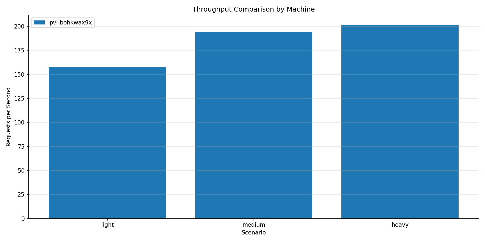
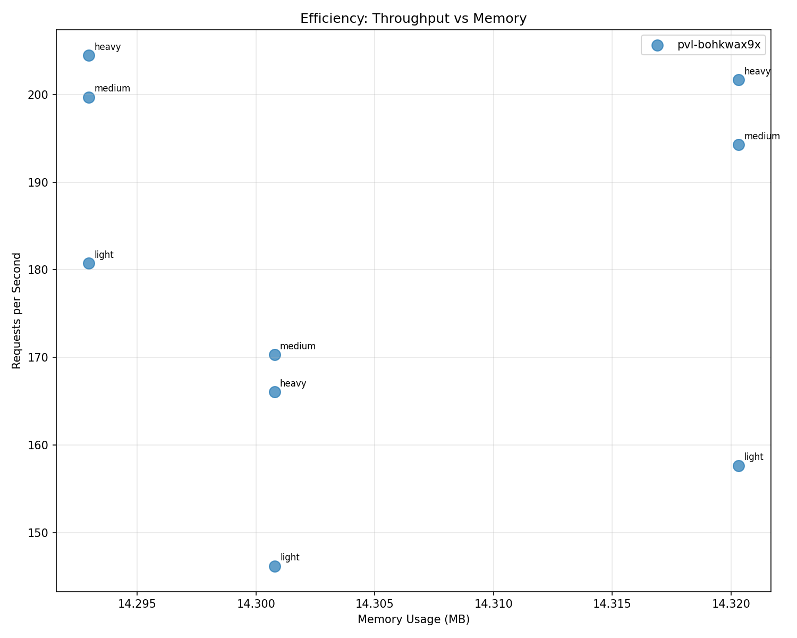
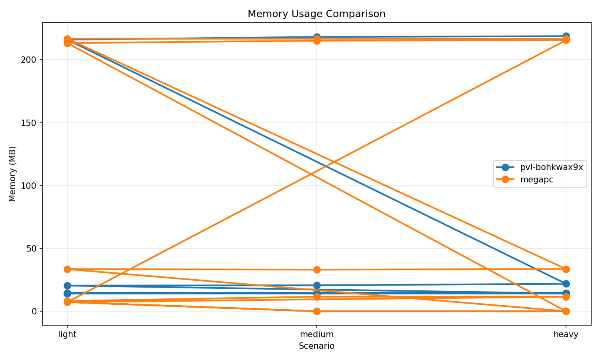

# svgd

A lightweight C monitoring system that renders SVG charts from RRD time-series files — ~0% CPU and ~10 MB RAM under load.

[](https://github.com/Pavelavl/svgd/actions/workflows/test.yml)
[](LICENSE)
[](https://en.wikipedia.org/wiki/C_(programming_language))
[](#)

> 🇬🇧 English | [🇷🇺 Русский](readme.ru.md)


## Why svgd?

- **Extreme resource efficiency** — handles up to **2830 RPS** at **~0% CPU** and **~10 MB RAM**. Graphite under comparable load uses 70% CPU and 241 MB RAM (**24x** more memory); RRDtool CGI is **28–58x slower** in RPS.
- **Embeddable, zero-dependency SVG output** — every endpoint returns a self-contained SVG chart you can drop into any page with a single `` or inline `<svg>`. No client-side JS or bundler required.
- **JS-extensible rendering** — charts are produced by an embedded Duktape engine running `src/scripts/generate_svg.js`, so you change chart appearance or behavior by editing JavaScript — no C recompile needed.
- **Data-driven metrics via `config.json`** — map any `endpoint` to an `rrd_path` (with `%s` URL parameters for per-process / per-interface charts) without touching code.
- **Multi-datasource routing** — `svgd-gate` fronts one or many `svgd` backends and selects the target from a `?datasource=` query param (see `datasources.json` and `docker-compose.multi.yml`).

---

## Components

- **svgd** — LSRP/HTTP server that renders SVG charts from RRD files
- **svgd-gate** — HTTP gateway with a web UI
- **collectd** — collects system metrics (external component)

---

## Installation

### Requirements

- **librrd-dev** — library for working with RRD files
- **duktape-dev** — Duktape JS engine for SVG generation
- **gcc** — C compiler
- **collectd** — system metrics collection
- **jq** — (optional) for parsing `config.json` in the Makefile

### Installing dependencies

```bash
sudo apt update
sudo apt install librrd-dev duktape-dev gcc jq
```

### Build

```bash
# Build all components
make build

# Backend only (LSRP server)
make build-backend
```

### Run

```bash
# HTTP gateway with web UI (port 8080)
make run

# LSRP server only (port from config.json, default 8081)
make run-backend
```

After starting it, open http://localhost:8080 in your browser.

---

## Configuration

### config.json structure

```json
{
  "server": {
    "tcp_port": 8081,
    "protocol": "lsrp",
    "allowed_ips": "127.0.0.1",
    "rrdcached_addr": "",
    "thread_pool_size": 4,
    "cache_ttl_seconds": 5,
    "verbose": 0
  },
  "rrd": {
    "base_path": "/opt/collectd/var/lib/collectd/rrd/localhost"
  },
  "js": {
    "script_path": "./scripts/generate_svg.js"
  },
  "metrics": [ /* array of metrics */ ]
}
```

### Server parameters

| Parameter | Description | Default |
|----------|----------|--------------|
| `tcp_port` | LSRP server port | 8081 |
| `allowed_ips` | Allowed IPs (comma-separated) | 127.0.0.1 |
| `rrdcached_addr` | rrdcached address (unix:/path or host:port) | "" |
| `thread_pool_size` | Thread pool size | 4 |
| `cache_ttl_seconds` | TTL for cached RRD data | 5 |
| `verbose` | Logging level | 0 |

### Metrics configuration

#### Required parameters

| Parameter | Description |
|----------|----------|
| `endpoint` | URL path used to access the metric |
| `rrd_path` | Path to the RRD file (relative to `base_path`) |

#### Optional parameters

| Parameter | Description |
|----------|----------|
| `requires_param` | Whether a URL parameter is required |
| `param_name` | Parameter name (shown in the UI) |
| `title` | Chart title (supports `%s`) |
| `y_label` | Y-axis label |
| `is_percentage` | Metric is a percentage (0–100%) |
| `transform_type` | Transform type: `none`, `divide`, `sum`, `multiply` |
| `transform_divisor` | Divisor for the transform (`divide`) |
| `value_format` | Output format (printf-style) |

#### Grafana integration

svgd-gate implements the [simpod / classic SimpleJson](https://github.com/grafana/simple-json-datasource) structured datasource wire protocol, so any Grafana instance can plot svgd metrics as time-series with **zero per-panel configuration** (metric dropdown + auto-rendered graph). All JSON parsing/assembly happens in the svgd backend (Duktape); the gate is a thin forwarder — no extra dependencies.

### Endpoints (base path `/grafana`)

| Method + path | Purpose |
|---|---|
| `GET /grafana` | "Save & Test" connection check → `200 {}` |
| `POST /grafana/search` | metric enumeration → `["cpu","ram",...]` |
| `POST /grafana/query` | time-series fetch → `[{"target":"cpu","datapoints":[[value, epoch_ms], ...]}]` |
| `POST /grafana/annotations` | stub → `[]` |

### Configure the datasource in Grafana

1. Install a compatible plugin: simpod `JSON Datasource`, or the classic `grafana-simple-json-datasource`.
2. Add a datasource of that type:
   - **URL**: `http://<svgd-gate-host>:8080/grafana`
   - **Access**: `Server` (recommended — Grafana proxies the request and injects auth headers, avoiding CORS).
   - **Custom HTTP Header**: `Authorization: Bearer <token>` — obtain the token from svgd-gate's auth (see [Authorization](#authorization)). If svgd auth is not configured, protected endpoints return 401, so configure auth and use a token.
3. **Save & Test** → should report success.
4. In a panel, choose the **Timeseries** query type, pick a metric from the dropdown (svgd's configured endpoints), and the graph renders. Multi-series metrics (per-disk, per-interface, …) return one target each.

### Notes / v1 limits

- **Time range**: the requested window width (`to − from`) is fetched as "last N seconds up to now". Relative Grafana ranges ("last 6h/24h") work; absolute historical windows are rounded to the width and fetched to now.
- **Timestamps**: rrd stores epoch seconds; responses are converted to epoch milliseconds for Grafana.
- **Large request bodies**: the `/query` body is forwarded through the LSRP param channel (capped); typical panels are well under the limit, but very large bodies (dozens of targets / heavy `scopedVars`) are rejected with `413`.
- **Multi-datasource**: pass `?datasource=<name>` to target a specific svgd backend, as with the REST API.
- The plugin repos are archived, but the **wire contract is stable**; svgd's JSON is reusable as-is by Grafana's Infinity datasource (with added JSONPath) should the plugin disappear.

---

## Metric examples

**CPU (simple metric):**
```json
{
  "endpoint": "cpu",
  "rrd_path": "cpu-total/percent-active.rrd",
  "title": "CPU Utilization",
  "y_label": "Usage (%)",
  "is_percentage": true,
  "value_format": "%.1f"
}
```

**Process memory (with parameter and transform):**
```json
{
  "endpoint": "ram/process",
  "rrd_path": "processes-%s/ps_rss.rrd",
  "requires_param": true,
  "param_name": "process_name",
  "title": "Memory Usage",
  "y_label": "Memory (MB)",
  "transform_type": "divide",
  "transform_divisor": 1048576,
  "value_format": "%.1f"
}
```

**Network (with parameter):**
```json
{
  "endpoint": "network",
  "rrd_path": "interface-%s/if_octets.rrd",
  "requires_param": true,
  "param_name": "interface",
  "title": "Network Traffic",
  "y_label": "Traffic (Mbit/s)",
  "transform_type": "divide",
  "transform_divisor": 125000,
  "value_format": "%.2f"
}
```

---

## API

### HTTP REST API (svgd-gate)

**Get the list of metrics:**
```bash
GET http://localhost:8080/_config/metrics
```

**Get an SVG chart:**
```bash
GET http://localhost:8080/<endpoint>?period=<seconds>
```

The `period` parameter is the time range in seconds (default 3600).

**Examples:**
```bash
# CPU over the last hour
curl http://localhost:8080/cpu

# CPU over 24 hours
curl http://localhost:8080/cpu?period=86400

# Process memory
curl http://localhost:8080/ram/process/postgres

# Network traffic
curl http://localhost:8080/network/eth0?period=7200
```

### LSRP Protocol API

```bash
./lsrp/bin/lsrp localhost:8081 "endpoint=<endpoint>&period=<seconds>"
```

**Examples:**
```bash
./lsrp/bin/lsrp localhost:8081 "endpoint=cpu&period=3600"
./lsrp/bin/lsrp localhost:8081 "endpoint=ram/process/systemd&period=7200"
```

---

## Metric examples

| Endpoint | Description | Parameter | Example |
|----------|----------|----------|--------|
| `cpu` | CPU usage (%) | — | [cpu.svg](examples/cpu.svg) |
| `cpu/process/<name>` | Process CPU time (s) | process_name | [cpu_process_systemd.svg](examples/cpu_process_systemd.svg) |
| `ram` | Memory usage (%) | — | [ram.svg](examples/ram.svg) |
| `ram/process/<name>` | Process memory (MB) | process_name | [ram_process_systemd.svg](examples/ram_process_systemd.svg) |
| `ram/cached` | Cached memory (%) | — | — |
| `ram/buffered` | Buffered memory (%) | — | — |
| `network/<iface>` | Network traffic (Mbit/s) | interface | [network.svg](examples/network.svg) |
| `network/packets/<iface>` | Network packets (packets/s) | interface | — |
| `network/errors/<iface>` | Network errors (errors/s) | interface | — |
| `disk/<disk>` | Disk operations (ops/s) | disk | [disk.svg](examples/disk.svg) |
| `disk/throughput/<disk>` | Disk throughput (MB/s) | disk | — |
| `disk/io_time/<disk>` | Disk I/O time (ms) | disk | — |
| `postgresql/connections` | PostgreSQL connections | — | [pgsql.svg](examples/pgsql.svg) |
| `system/load` | Load average | — | — |
| `system/uptime` | System uptime (hours) | — | — |
| `swap/bytes` | Swap usage (MB) | — | — |
| `swap/percent` | Swap usage (%) | — | — |
| `filesystem/<mount>` | Filesystem usage (GB) | mount_point | — |
| `filesystem/free/<mount>` | Filesystem free space (GB) | mount_point | — |
| `process/count/<name>` | Process count | process_name | — |
| `tcp/connections` | TCP ESTABLISHED connections | — | — |
| `tcp/time_wait` | TCP TIME_WAIT connections | — | — |
| `thermal` | CPU temperature (°C) | — | — |

---

## Web interface

### Features

- Add panels dynamically from the metrics list
- Configurable time range (5 min — 7 days)
- Auto-refresh with a configurable interval
- Panel search and filtering
- Fullscreen mode
- SVG chart export
- Light and dark themes
- Dashboard config export/import
- Dashboard snapshots (HTML with all charts)

### Hotkeys

- `Esc` — close modal windows

---

## Authorization

### Overview

svgd-gate supports token-based authorization using JWT-like tokens signed with HMAC-SHA256.

### Setup

1. Create `gate/auth/auth.json` from the example:

```bash
cp auth.example.json gate/auth/auth.json
```

2. Edit `gate/auth/auth.json`:

```json
{
  "password": "your_strong_password",
  "jwt_secret": "random_secret_at_least_32_characters",
  "token_expiry_days": 7
}
```

3. Restart svgd-gate

### Configuration

- `password`: Password used to obtain a token (minimum 1 character, 8+ recommended)
- `jwt_secret`: Secret key for signing tokens (minimum 32 characters; use a random string)
- `token_expiry_days`: Token lifetime in days (default: 7)

### Security

- `auth.json` contains secrets and must NOT be committed to version control
- Set its permissions: `chmod 600 gate/auth/auth.json`
- Use strong, randomly generated passwords and secrets
- HTTPS is recommended in production
- Tokens are stored in `localStorage` on the client

### Usage

Users reach the dashboard at `/index.html`. If they are not authorized, they are redirected to `/login.html` to enter a password. After successful authentication a JWT token is issued and stored in `localStorage`. Every API request includes this token in the `Authorization: Bearer <token>` header.

Tokens expire after the configured number of days, after which re-authentication is required.

### API endpoints

- `POST /_auth/login` — obtain a token by password
- All other endpoints require a valid token in the `Authorization` header
- Static files (HTML, JS, CSS) are served publicly

Detailed documentation: [gate/auth/README.md](gate/auth/README.md)

---

## Performance

For detailed results and the development trajectory, see the [Evolution](#evolution) and [Comparison with analogues (detailed)](#comparison-with-analogues-detailed) sections.

---

## Evolution

Benchmarks were run on two machines.

### svgd throughput (RPS) on megapc (i7-14700KF, 28 cores)

| Date | Light (c=1) | Medium (c=10) | Heavy (c=50) | CPU (light) |
|------|-------------|---------------|--------------|-------------|
| 14.03 | 467 | 579 | 578 | 1.3% |
| 31.03 | 896 | 1407 | 1425 | 0.8% |
| 01.04 | **1347** | **2737** | **2830** | **~0%** |

- Throughput growth over 18 days: **~3x (light)** to **~5x (heavy)**
- Latency at c=50 dropped from ~110 ms to ~4 ms (**~28x**)
- CPU under light load dropped from 1.3% to ~0% — the system barely consumes any resources
- Memory is a stable ~7–11 MB across all scenarios

### Comparison with analogues (01.04, megapc)

| Metric | svgd | Graphite | RRDtool CGI |
|---------|------|----------|-------------|
| **RPS (light)** | **1347** | 320 | 48 |
| **RPS (heavy)** | **2830** | 1485 | 48 |
| **Latency P99 (light)** | **1.1 ms** | 3.7 ms | 22.4 ms |
| **CPU (light)** | **~0%** | 70% | 110% |
| **Memory** | **~10 MB** | 241 MB | 36 MB |

### Key killer features

1. **Extremely low resource consumption** — svgd handles up to 2830 RPS at ~0% CPU and ~10 MB of memory. Graphite under comparable load uses 70% CPU and 241 MB RAM (**24x** more memory).

2. **Linear scaling** — throughput grows proportionally with concurrency: from 1347 RPS (c=1) to 2830 RPS (c=50). Latency barely degrades: 0.7 ms → 3.5 ms.

3. **Orders of magnitude over RRDtool CGI** — svgd is **28–58x faster** in RPS, while RRDtool consumes 110% CPU (i.e. it is bottlenecked by a single core) and 3.5x more memory.

4. **Fast evolution** — over 18 days of development, throughput grew **3–5x** and latency under high load dropped **28x** — the product is being actively optimized.

5. **Energy efficient** — svgd generates SVG charts from RRD files while consuming an order of magnitude fewer resources than the alternatives. Ideal for embedding into low-power hardware and IoT.

---

## Comparison with analogues (detailed)

Performance comparison of svgd with RRDtool CGI and Graphite when generating SVG charts.
Data from 01.04.2026, machine megapc (i7-14700KF, 28 cores, 15 GB RAM, Arch Linux).

**Test configuration:** 1000 requests, period 3600 sec (1 hour of data)

#### Throughput (RPS)

| System | Light (c=1) | Medium (c=10) | Heavy (c=50) |
|---------|-------------|---------------|--------------|
| **svgd** | **1347** | **2737** | **2830** |
| **Graphite** | 320 | 1488 | 1485 |
| **RRDtool CGI** | 48 | 48 | 48 |

#### Latency P99 (ms)

| System | Light (c=1) | Medium (c=10) | Heavy (c=50) |
|---------|-------------|---------------|--------------|
| **svgd** | **1.1** | **5.5** | **18.6** |
| **Graphite** | 3.7 | 8.1 | 35.9 |
| **RRDtool CGI** | 22.4 | 215.4 | 1080.0 |

#### Resources: CPU (%)

| System | Light | Medium | Heavy |
|---------|-------|--------|-------|
| **svgd** | **~0%** | **~0%** | **~0%** |
| **Graphite** | 70% | 0.2% | 0.2% |
| **RRDtool CGI** | 110% | 110% | 110% |

#### Resources: Memory (MB)

| System | Light | Medium | Heavy |
|---------|-------|--------|-------|
| **svgd** | **~10** | **~10** | **~10** |
| **Graphite** | 241 | 241 | 241 |
| **RRDtool CGI** | 36 | 35 | 38 |

### Comparison charts

<p align="center">
  
</p>

<p align="center">
  
</p>

<p align="center">
  
</p>

### Conclusions

- **svgd vs RRDtool CGI**: svgd is **28–58x faster** in RPS, latency is **20–58x lower**, memory use is **3.5x lower**
- **svgd vs Graphite**: svgd is **4.2x faster** under light load (1347 vs 320 RPS), while Graphite uses **24x more memory** (241 MB vs 10 MB) and 70% CPU
- **RRDtool CGI**: does not scale at all — 48 RPS under any load, CPU pinned at 110% (single-core ceiling), latency grows up to 1080 ms
- **Graphite**: scales well in throughput, but requires 241 MB RAM even with no load
- **svgd**: the only system with ~0% CPU under every load and minimal memory consumption (~10 MB)

### Running the benchmark

```bash
# Full cycle: tests + charts + report
make report

# Or step by step:
make test-bench-svgd       # svgd only (no Docker)
make test-bench            # svgd vs RRDtool vs Graphite (requires Docker)
make generate-charts       # generate comparison charts
make generate-report       # generate the markdown report
```

---

## rrdcached

Set up rrdtool following the [guide](https://github.com/Pavelavl/cpu-http-monitor).

To improve performance when working with RRD files:

```bash
sudo rrdcached -p /var/run/rrdcached.pid \
               -l unix:/var/run/rrdcached.sock \
               -B -F \
               -b /opt/collectd/var/lib/collectd/rrd \
               -j /var/lib/rrdcached/journal \
               -f 3600 -w 1800 -z 900
```

In `config.json`:
```json
"rrdcached_addr": "unix:/var/run/rrdcached.sock"
```

---

## collectd

Set up collectd following the [guide](https://github.com/Pavelavl/cpu-http-monitor).

Example configurations live in [.infra/collectd/](.infra/collectd/):

```
collectd/
├── collectd.conf
└── collectd.conf.d/
    ├── cpu.conf
    ├── df.conf
    ├── disk.conf
    ├── load.conf
    ├── network.conf
    ├── processes.conf
    ├── swap.conf
    ├── tcpconns.conf
    ├── thermal.conf
    └── uptime.conf
```

---

## Testing

```bash
# All tests
make test

# E2E tests
make test-e2e

# Load tests
make test-load

# UI tests (requires Python)
make test-ui
```

---

## Docker

```bash
# Build
make docker-build

# Run
make docker-up

# Logs
make docker-logs

# Stop
make docker-down

# Tests in Docker
make docker-test
```

---

## Project structure

```
svgd/
├── bin/                    # Binaries
│   ├── svgd                # LSRP server
│   └── svgd-gate           # HTTP gateway
├── gate/                   # HTTP gateway
│   ├── main.c
│   ├── auth/               # Authorization (JWT)
│   │   ├── auth.c
│   │   └── auth.h
│   └── static/             # Web UI
│       ├── index.html
│       ├── login.html
│       ├── script.js
│       └── auth.js
├── include/                # Headers
│   ├── cfg.h
│   ├── handler.h
│   ├── http.h
│   ├── rrd_r.h
│   └── rrd/
│       ├── cache.h
│       ├── reader.h
│       └── svg.h
├── src/                    # Backend sources
│   ├── cfg.c
│   ├── handler.c
│   ├── http.c
│   ├── main.c
│   ├── rrd/
│   │   ├── cache.c
│   │   ├── reader.c
│   │   └── svg.c
│   └── scripts/
│       └── generate_svg.js
├── scripts/                # Symlink → src/scripts/
├── tests/                  # Tests (Go)
│   ├── internal/
│   │   ├── e2e/            # E2E tests
│   │   ├── load/           # Load tests
│   │   ├── ui/             # UI tests (Selenium/Python)
│   │   └── comparison/     # Cross-system benchmark
│   ├── shared/             # Shared test utilities
│   └── results/            # Test results and reports
├── lsrp/                   # LSRP protocol (submodule)
├── examples/               # Example SVG charts
├── .infra/                 # Infrastructure (collectd, Docker)
├── .github/workflows/      # CI/CD (GitHub Actions)
├── config.json             # Configuration
├── datasources.json        # Data sources for multi-backend
├── deploy.sh               # Deploy script
├── makefile
├── Dockerfile              # Main Docker image
├── Dockerfile.base         # Base image for the build
├── Dockerfile.tests        # Image for running tests
├── docker-compose.yml      # Docker Compose (main)
└── docker-compose.multi.yml # Docker Compose (multi-datasource)
```

---

## Troubleshooting

### The server won't start

```bash
# Check the ports
ss -tulpn | grep -E '8080|8081'

# Check RRD permissions
ls -la /opt/collectd/var/lib/collectd/rrd/

# Run with logs
./bin/svgd ./config.json
```

### Charts don't render

```bash
# Check the RRD files
ls /opt/collectd/var/lib/collectd/rrd/localhost/

# Check the API
curl http://localhost:8080/_config/metrics
curl http://localhost:8080/cpu
```

### Low performance

1. Enable rrdcached in `config.json`
2. Increase `thread_pool_size`
3. Decrease the auto-refresh interval in the UI

---

## Related projects

- [LSRP](https://github.com/pavelavl/lsrp) — Lightweight Simple Request Protocol
- [collectd](https://github.com/collectd/collectd) — System metrics collection
- [Duktape](https://github.com/svaarala/duktape) — Embedded JavaScript engine
