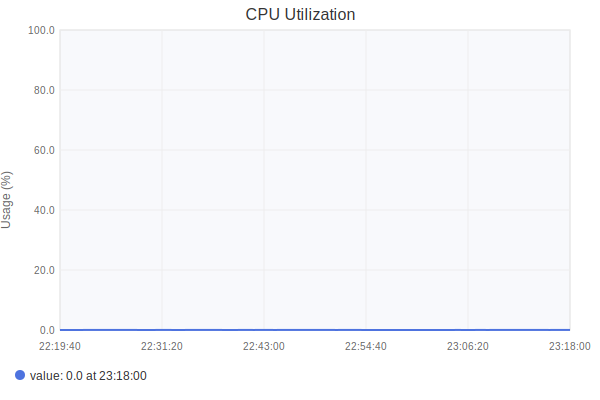
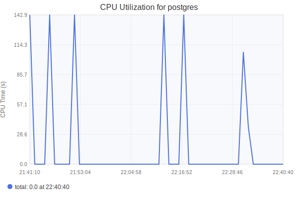
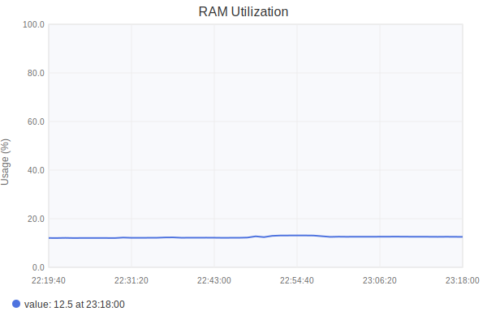
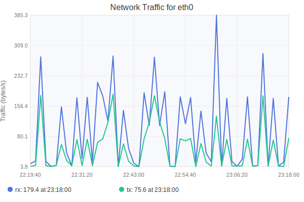
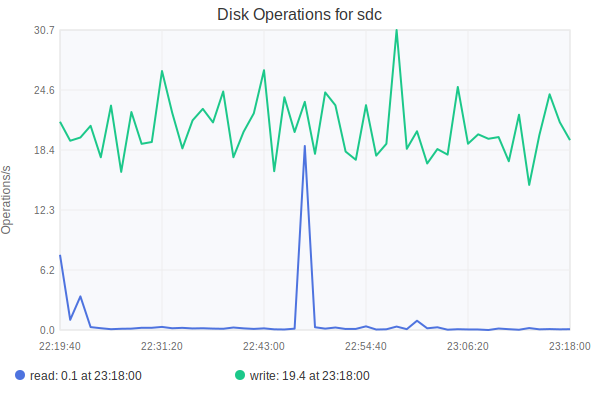
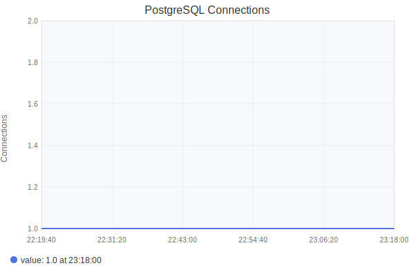

# svgd

## Установка и настройка
### Требования

Зависимости:
- librrd-dev — библиотека для работы с RRD-файлами.
- libduktape-dev — JavaScript-движок Duktape для генерации SVG.
- gcc — компилятор для сборки программы.
- rrdcached — демон для кэширования RRD-данных.
- inih
- collectd

---

### Настройка collectd
Сборку и развертывание collectd производить по [этой](https://github.com/Pavelavl/cpu-http-monitor) инструкции. Конфигурации для этого приложения лежат в [./collectd](./collectd)

---

### Установка зависимостей
```sh
sudo apt update
sudo apt install librrd-dev libduktape-dev gcc
```

---

### Настройка rrdcached

Для повышения производительности при работе с RRD-файлами используется демон rrdcached. Запустите его с указанными параметрами:

```sh
sudo rrdcached -p /var/run/rrdcached.pid \
               -l unix:/var/run/rrdcached.sock \
               -B \
               -F \
               -b /opt/collectd/var/lib/collectd/rrd \
               -j /var/lib/rrdcached/journal \
               -f 3600 \
               -w 1800 \
               -z 900
```

#### Описание параметров:
- -p /var/run/rrdcached.pid — путь к файлу PID демона.
- -l unix:/var/run/rrdcached.sock — использование Unix-сокета для связи с сервером.
- -B — запрет записи в RRD-файлы, если их базовый путь не соответствует указанному.
- -F — принудительная синхронизация данных на диск.
- -b /opt/collectd/var/lib/collectd/rrd — базовый путь для RRD-файлов.
- -j /var/lib/rrdcached/journal — путь для журнала обновлений.
- -f 3600 — интервал полной синхронизации данных (в секундах).
- -w 1800 — интервал записи данных на диск (в секундах).
- -z 900 — задержка перед записью данных (в секундах).

> Убедитесь, что директории /opt/collectd/var/lib/collectd/rrd и /var/lib/rrdcached/journal существуют и доступны для записи:
```sh
sudo mkdir -p /opt/collectd/var/lib/collectd/rrd /var/lib/rrdcached/journal
sudo chown $(whoami) /opt/collectd/var/lib/collectd/rrd /var/lib/rrdcached/journal
```

---

## Сборка и запуск сервера

### Скомпилируйте сервер:
```sh
gcc -o svgd src/*.c inih/ini.c -Iinih -lrrd -lduktape
```

Запустите сервер, указав путь к конфигурационному файлу (по умолчанию config.ini):
```sh
./svgd config.ini
```
Сервер запустится на порту, указанном в config.ini (по умолчанию 8080).

---

## Конфигурация

Конфигурация сервера задаётся в файле config.ini
> [Пример файла](config.ini)

### Описание секций:

> #### server:
> - tcp_port — порт, на котором запускается HTTP-сервер (по умолчанию 8080).
> - rrdcached_addr — адрес rrdcached (например, unix:/var/run/rrdcached.sock).
> - allowed_ips — список разрешённых IP-адресов для доступа (например, 127.0.0.1).

> #### rrd:
> - base_path — базовый путь к RRD-файлам (например, /opt/collectd/var/lib/collectd/rrd/localhost).
> - cpu_total — путь к RRD-файлу для общей загрузки CPU.
> - cpu_process — шаблон пути для загрузки CPU конкретного процесса (использует %s для имени процесса).
> - ram_total — путь к RRD-файлу для общей загрузки памяти.
> - ram_process — шаблон пути для использования памяти конкретным процессом.
> - network — шаблон пути для сетевого трафика интерфейса.
> - disk — шаблон пути для операций диска.
> - postgresql_connections — путь к RRD-файлу для соединений PostgreSQL.

> js:
> - script_path — путь к JavaScript-скрипту для генерации SVG (например, scripts/generate_cpu_svg.js).

---

## API
> Сервер предоставляет HTTP API для получения SVG-графиков метрик системы. Все запросы отправляются по адресу http://localhost:8080/<endpoint>. Параметр period (в секундах) можно добавить в запрос, чтобы указать временной диапазон данных (по умолчанию 3600 секунд, или 1 час), например: http://localhost:8080/cpu?period=7200.

### 1. Общая загрузка CPU

- Эндпоинт: GET /cpu
- Описание: Возвращает SVG-график общей загрузки CPU в процентах (0–100%).
- Метрика: cpu_total
- RRD-файл: <rrd_base_path>/<path_cpu_total> (например, /opt/collectd/var/lib/collectd/rrd/localhost/cpu-total/percent-active.rrd)



### 2. Загрузка CPU для процесса

- Эндпоинт: GET /cpu/process/<process_name>
- Описание: Возвращает SVG-график времени CPU для указанного процесса (в секундах).
- Метрика: cpu_process
- RRD-файл: <rrd_base_path>/<path_cpu_process> с заменой %s на <process_name> (например, /opt/collectd/var/lib/collectd/rrd/localhost/processes-postgres/ps_cputime.rrd)



### 3. Общая загрузка памяти

- Эндпоинт: GET /ram
- Описание: Возвращает SVG-график общей загрузки памяти в процентах (0–100%).
- Метрика: ram_total
- RRD-файл: <rrd_base_path>/<path_ram_total> (например, /opt/collectd/var/lib/collectd/rrd/localhost/memory/percent-used.rrd)



### 4. Использование памяти процессом

- Эндпоинт: GET /ram/process/<process_name>
- Описание: Возвращает SVG-график использования памяти указанным процессом (в мегабайтах).
- Метрика: ram_process
- RRD-файл: <rrd_base_path>/<path_ram_process> с заменой %s на <process_name> (например, /opt/collectd/var/lib/collectd/rrd/localhost/processes-postgres/ps_rss.rrd)


### 5. Сетевой трафик

- Эндпоинт: GET /network/<interface>
- Описание: Возвращает SVG-график сетевого трафика для указанного интерфейса (в байтах/с).
- Метрика: network
- RRD-файл: <rrd_base_path>/<path_network> с заменой %s на <interface> (например, /opt/collectd/var/lib/collectd/rrd/localhost/interface-eth0/if_octets.rrd)



### 6. Дисковые операции

- Эндпоинт: GET /disk/<disk>
- Описание: Возвращает SVG-график операций ввода-вывода для указанного диска (операции/с).
- Метрика: disk
- RRD-файл: <rrd_base_path>/<path_disk> с заменой %s на <disk> (например, /opt/collectd/var/lib/collectd/rrd/localhost/disk-sda/disk_ops.rrd)




### 7. Соединения PostgreSQL

- Эндпоинт: GET /postgresql/connections
- Описание: Возвращает SVG-график количества активных соединений PostgreSQL.
- Метрика: postgresql_connections
- RRD-файл: <rrd_base_path>/<path_postgresql_connections> (например, /opt/collectd/var/lib/collectd/rrd/localhost/postgresql-stand/pg-numbackends.rrd)


